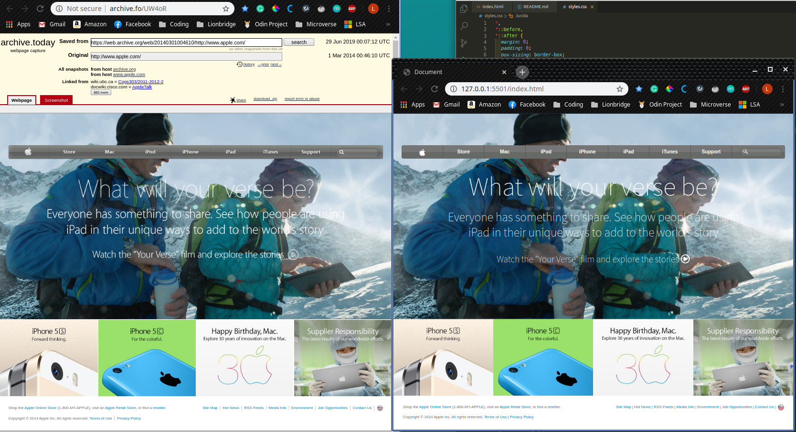

# Project Name

> Backgrounds and Gradients

This is a project based on an archived Apple website. In this project I used all the previous knowledge and I also applied some new knowledge for background images and gradients. This website is responsive but the main design was based on a small-sized archive website; this means the optimal size is approximately 1,026 x 829p, and the scaled Full HD 1920 x 1080p looks like the second image.

## Built With

- HTML
- CSS

## Live Demo

[Live Demo Link]()

## Getting Started

**Need web browser.**

To get a local copy up and running follow these simple example steps.

### [Download Repository](https://github.com/lmaldonadoch/apple_website/tree/design)

## Author

👤 **Luis Angel Maldonado**

- Github: [@lmaldonadoch](https://github.com/lmaldonadoch)

## 🤝 Contributing

Contributions, issues and feature requests are welcome!

Feel free to check the [issues page](https://github.com/lmaldonadoch/apple_website/issues).

## Show your support

Give a ⭐️ if you like this project!

## Acknowledgments

- This project was inspired in an old Apple website although no code was taken from it.
- The project idea was taken from The Odin Project.
